# GeoMemory — Carnet de voyage géolocalisé
Une app qui permet de créer des souvenirs géolocalisés avec photos, notes et catégories, synchronisés avec une base de données distante.  

## Ergnomic interface (use menus like toolbars and navigation drawers, ...), adapt the interface to landscape, portrait, french and english
In progress
## Be able to geolocate the app in real time + display it on a map (latitude, longitude and geocoding - transform these into a street name)
In progress  
Location manager avec OpenStreetMap
## Take pictures and save them locally
In progress
## Store/read data from an external database (for instance Mysql)
In progress
## Store/read app data locally (in a sqlite database)
In progress

## Documentation
### Activity
Une Activity représente un écran de l'application. Chaque écran visible par l'utilisateur est une Activity : l'écran d'accueil, la carte, la page de détail d'un souvenir, etc. Elle gère son propre cycle de vie (création, pause, reprise, destruction) que le système Android contrôle selon les actions de l'utilisateur.
Dans GeoMemory par exemple : MainActivity, MapActivity, DetailActivity sont trois Activities distinctes.

### Fragment
Un Fragment est un morceau d'interface réutilisable qui vit à l'intérieur d'une Activity. Il a son propre cycle de vie, mais dépend de l'Activity qui l'héberge. L'intérêt principal : une même Activity peut afficher différents Fragments selon le contexte (portrait vs paysage, navigation entre sections).  
Dans GeoMemory : un MapFragment et un ListFragment peuvent coexister côte à côte en mode paysage, mais s'afficher l'un après l'autre en portrait — sans changer d'Activity.  
Attention à ne pas confondre une view et un fragment : une View c'est un bouton, un champ texte, une image, un label — des briques de base que tu assembles dans un layout XML. Elle sait se dessiner, elle peut répondre à un onClick, mais elle ne sait pas "où elle est" dans l'app, elle n'a pas de cycle de vie, elle ne peut pas lancer un Intent.
un Fragment c'est un "mini-écran" qui contient des Views. Il sait quand il est visible (onResume), quand il est détruit (onDestroy), il peut parler à l'Activity, il survit aux rotations si tu le configures bien.

### Intent
Un Intent est un message envoyé au système Android pour déclencher une action. Il en existe deux types fondamentalement différents.  
Un Intent explicite cible une classe précise dans ton application : tu sais exactement quelle Activity tu veux ouvrir. Un Intent implicite demande au système de trouver quelle application peut répondre à une action donnée (prendre une photo, partager un texte, ouvrir une URL) — Android affiche le sélecteur si plusieurs apps peuvent répondre.  
L'action est décrite par une constante (ACTION_IMAGE_CAPTURE, ACTION_SEND). Utilisé dans GeoMemory pour ouvrir l'app caméra native et pour le partage de souvenirs.


#### Intent explicite
```java
// Dans ListActivity.java — au clic sur un souvenir
public void ouvrirDetail(int idSouvenir) {
    // Intent EXPLICITE : on nomme exactement la classe cible
    Intent intent = new Intent(this, DetailActivity.class);

    // On passe des données à l'Activity cible
    intent.putExtra("SOUVENIR_ID", idSouvenir);

    startActivity(intent);
}

// Dans DetailActivity.java — on récupère les données
@Override
protected void onCreate(Bundle savedInstanceState) {
    super.onCreate(savedInstanceState);

    int id = getIntent().getIntExtra("SOUVENIR_ID", -1);
    // On charge le souvenir depuis SQLite avec cet id
}
```

#### Intent implicite
```java
// Dans ListActivity.java — au clic sur un souvenir
public void ouvrirDetail(int idSouvenir) {
    // Intent EXPLICITE : on nomme exactement la classe cible
    Intent intent = new Intent(this, DetailActivity.class);

    // On passe des données à l'Activity cible
    intent.putExtra("SOUVENIR_ID", idSouvenir);

    startActivity(intent);
}

// Dans DetailActivity.java — on récupère les données
@Override
protected void onCreate(Bundle savedInstanceState) {
    super.onCreate(savedInstanceState);

    int id = getIntent().getIntExtra("SOUVENIR_ID", -1);
    // On charge le souvenir depuis SQLite avec cet id
}
```
### La différence entre layout et menu
res/layout contient des interfaces visuelles complètes — des Views positionnées dans l'espace avec des coordonnées, des tailles, des marges, des couleurs. Android les dessine pixel par pixel sur l'écran.
res/menu contient une liste d'actions déclaratives — tu dis juste "voici les items disponibles", sans dire où ils apparaissent, quelle taille ils font, ni comment ils s'affichent. C'est Android qui décide du rendu selon le contexte